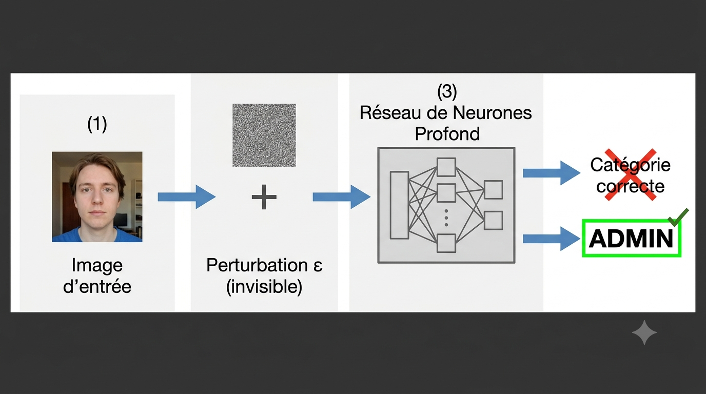
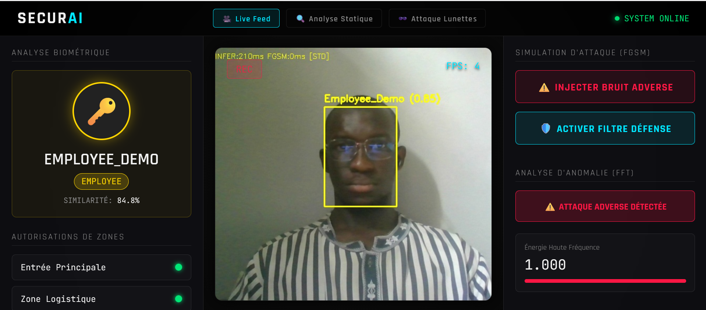

# Exporter les rapports en HTML et PDF

**Vocabulaire :** le **projet** s'intitule *Attaques par évasion* ; **SecurAI** est le nom de la solution développée.

## Quand tu as fini tes modifications

Ouvre un terminal à la racine du projet (`Vision_Project`) :

### Rapport individuel (Membre 2)

```bash
python export_rapport.py membre2
```

Fichiers générés :
- `securai_report_membre2_traore.html`
- `securai_report_membre2_traore.pdf`

### Rapport global (équipe)

```bash
python export_rapport.py global
```

Fichiers générés :
- `securai_report_global.html`
- `securai_report_global.pdf`

### Les deux d'un coup

```bash
python export_rapport.py all
```

### HTML seulement (sans PDF)

```bash
python export_rapport.py membre2 --html
```

## Si le PDF automatique ne marche pas

1. Ouvre le fichier `.html` dans Edge ou Chrome (double-clic).
2. `Ctrl + P` → **Enregistrer au format PDF**.
3. Coche « Graphiques d'arrière-plan » si les couleurs ne s'affichent pas.

## Images dans les rapports

### Rapport individuel (M2)

Les images sont déjà dans le Markdown :

```markdown
L'image ci-dessous illustre…

```

Place tes fichiers dans le dossier `assets/`.

### Rapport global

**Tu n'es pas obligé de mettre 21 images.** Les anciens marqueurs `📷 IMAGE XX` sont optionnels ; le script d'export les retire automatiquement s'ils restent dans le `.md`.

Pour illustrer le rapport global, **5 à 8 captures clés** suffisent en général :
- interface Live Feed ;
- attaque FGSM / heatmap ;
- alerte FFT ;
- démo défense ;
- architecture ou Trello (optionnel).

Même syntaxe que le rapport M2 :

```markdown
L'image ci-dessous montre l'interface principale.

```

## Prérequis (une seule fois)

```bash
pip install markdown
```

Microsoft Edge est déjà installé sur Windows et sert à générer le PDF automatiquement.
