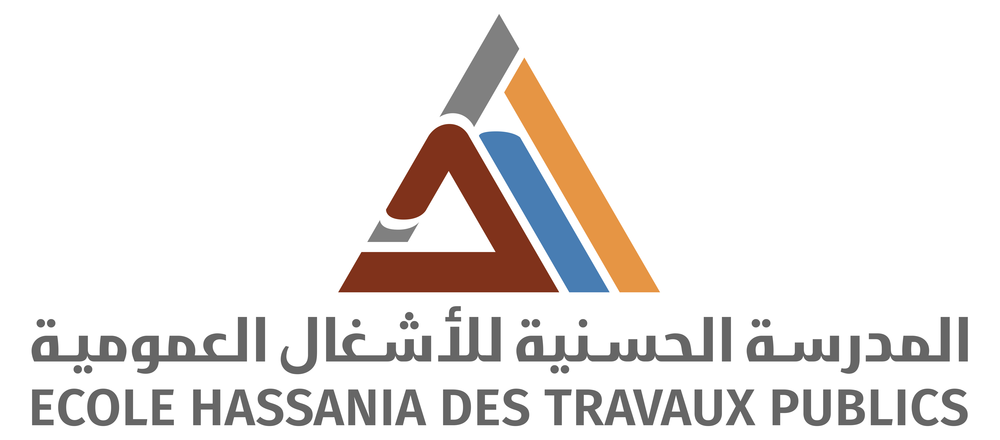
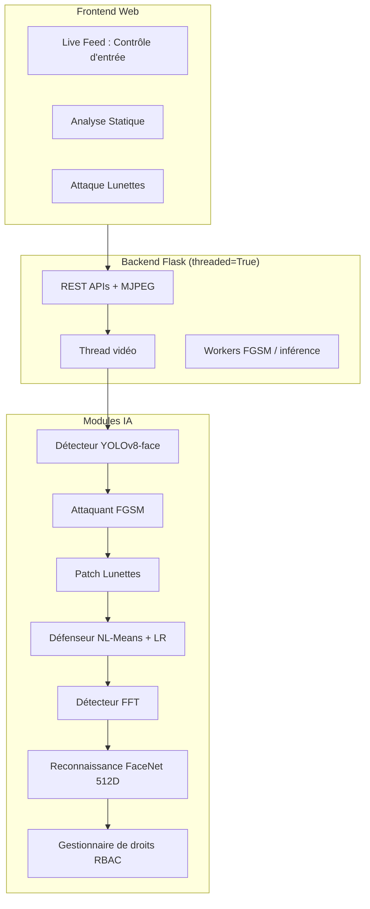

# Rapport Technique

| | |
|---|---|
| **Établissement** | École Hassania des Travaux Publics (EHTP) |
| **Projet** | Attaque par évasion |
| **Solution** | SecurAI (surnom du POC développé) |
| **Équipe** | NADAHE Mohamed · TRAORE Fanogo Mohamed · ZOGBELEMOU Francois · SAFARE Yassin |
| **Périmètre** | Proof of Concept (POC) de contrôle d'accès biométrique |
| **Durée** | 10 semaines (5 sprints Agile) |

---

## 1. Présentation du Projet

### 1.1 Contexte et objectifs

Notre **projet** porte sur les **attaques par évasion** appliquées à la reconnaissance faciale. Pour le matérialiser, nous avons développé un POC que nous avons surnommé **SecurAI** : une solution de démonstration pédagogique et technique visant à **évaluer la robustesse** d'une chaîne biométrique face à ces attaques, et à **proposer des mécanismes de défense** opérationnels en temps réel.

Le projet répond à la question centrale : *un système biométrique moderne (FaceNet + détection YOLO) peut-il être contourné par une perturbation numérique imperceptible, et comment le détecter ou le neutraliser sans bloquer les utilisateurs légitimes ?*

**Objectifs atteints :**

- Démontrer une attaque FGSM/I-FGSM ciblée sur le flux vidéo live.
- Démontrer une attaque par patch adversarial (lunettes) en surimpression locale.
- Implémenter des défenses complémentaires : rejet par analyse fréquentielle (FFT), nettoyage adaptatif du flux, classificateurs neuronaux de rejet.
- Fournir une interface web de contrôle d'accès (glassmorphism) avec monitoring temps réel.

### 1.2 Scénarios de menace étudiés et choix du cas d'usage

Deux scénarios réalistes d'attaque adversariale sur des systèmes biométriques ont été analysés en amont du projet afin de cadrer le périmètre fonctionnel et les exigences de démonstration.

#### Scénario A : Contournement de contrôle d'accès biométrique (physique)

Dans ce scénario, un site sensible (datacenter, salle serveurs, locaux administratifs) est protégé par une caméra de reconnaissance faciale couplée à un système de contrôle d'accès par zones. L'attaquant ne cherche pas seulement à « brouiller » le système : il vise une **usurpation d'identité ciblée**, en forçant le classificateur à le reconnaître comme un **manager** ou un employé autorisé.

**Vecteur d'attaque :** perturbation FGSM calculée sur le crop visage, ou patch adversarial en forme de lunettes superposé sur la région faciale. L'attaque peut être injectée numériquement sur le flux vidéo (scénario Man-in-the-Middle) ou simulée en live devant la webcam du POC.

**Impact :** élévation de privilèges physiques, accès à des zones restreintes (stock, caisse, serveur), contournement du journal de sécurité.

**Atouts pour un POC académique :** démonstration visuelle immédiate (zones d'accès qui passent au vert), pipeline complet détection → attaque → défense → décision, forte valeur pédagogique sur la cybersécurité opérationnelle.

#### Scénario B : Usurpation d'identité pour transactions financières (vérification d'identité en ligne)

Dans ce second scénario, l'attaquant cible des procédures de **connaissance du client** : en anglais *Know Your Customer* (**KYC**) : ce sont les contrôles d'identité imposés par les banques et fintechs lors d'une ouverture de compte, d'un virement sensible ou d'une validation biométrique sur mobile. Il injecte une perturbation adverse calculée localement sur le flux de la caméra frontale du smartphone, dans le but de faire valider l'identité d'une victime sans posséder ses traits biométriques réels.

**Vecteur d'attaque :** même famille de perturbations (FGSM, patch), mais contraintes différentes : résolution variable, compression vidéo du pipeline mobile, latence réseau, absence de contrôle sur l'environnement de capture.

**Impact :** fraude financière, usurpation d'identité légale automatisée à grande échelle.

**Limites pour notre POC :** nécessiterait une couche mobile (application native ou PWA), intégration avec un prestataire KYC réel, et des contraintes réglementaires (RGPD, audit) hors périmètre d'un projet pédagogique de 10 semaines.

#### Décision retenue

**Le Scénario A - contournement de contrôle d'accès biométrique - a été retenu** comme fil directeur du projet, démontré via notre solution **SecurAI**, pour les raisons suivantes :

1. **Faisabilité technique** : un prototype webcam + serveur Flask permet de boucler l'ensemble de la chaîne en local, sans dépendance à un écosystème bancaire.
2. **Démonstrabilité** : l'interface à quatre zones (entrée, stock, caisse, serveur) rend l'impact de l'attaque et de la défense immédiatement visible pour un jury ou un client.
3. **Couverture complète du pipeline** : détection YOLO, reconnaissance FaceNet, attaque FGSM et patch lunettes, défenses FFT et débruitage : tous ces modules s'intègrent naturellement dans un flux vidéo temps réel.
4. **Alignement pédagogique** : le scénario illustre clairement la notion d'élévation de privilèges, centrale en cybersécurité.

Le Scénario B reste documenté comme **perspective d'extension** : les mécanismes d'attaque et de défense développés dans SecurAI sont transposables à tout système de reconnaissance faciale consommant un flux image, y compris un pipeline KYC.

---

## 2. Fondements Théoriques : Attaques Adversariales et FGSM

### 2.1 Qu'est-ce qu'une attaque adversariale ?

Dans le Deep Learning appliqué à la vision, une attaque adversariale consiste à injecter une perturbation imperceptible à l'œil humain, mais calculée pour altérer les activations internes d'un réseau de neurones et modifier radicalement la prédiction finale (ici, l'embedding 512D de FaceNet).

```
[ Image Clean ] ---> ( FaceNet ) ---> Embedding Cohérent
     +
[ Perturbation ] ---> ( FaceNet ) ---> Embedding Altéré (Bypass)
```

### 2.2 Historique : Goodfellow et al. (2014)

L'attaque **FGSM** (*Fast Gradient Sign Method*) a été formalisée par Ian Goodfellow, Jonathon Shlens et Christian Szegedy en 2014 (*« Explaining and Harnessing Adversarial Examples »*). Elle remplace les optimisations pixel-par-pixel coûteuses par une seule étape de gradient sur l'image d'entrée.

### 2.3 Formulation mathématique

$$\eta = \epsilon \cdot \text{sign}\left(\nabla_x L(\theta, x, y)\right)$$

$$x_{adv} = x + \eta$$

Où $x$ est l'image d'entrée, $y$ le label cible, $\theta$ les poids gelés du réseau, $L$ la fonction de perte, et $\epsilon$ le facteur de perturbation.

**Extension implémentée dans SecurAI :** variante I-FGSM/PGD itérative (10 pas de gradient avec projection), plus agressive qu'un FGSM mono-pas, appliquée à la fois sur l'image entière (attaque globale) et sur une zone masquée (patch lunettes).

---

## 3. Architecture Technique et Stack Logicielle

### 3.1 Vue d'ensemble modulaire

L'architecture sépare détection, reconnaissance, attaque, défense et interface. L'état global est partagé entre threads via une structure `SystemState` protégée par des verrous (`threading.Lock`), ce qui permet au thread de capture vidéo et au thread de traitement IA de coexister sans corruption de données.



### 3.2 Modes de déploiement

Le système supporte trois modes de déploiement selon les ressources matérielles disponibles :

| Mode | Description |
|------|-------------|
| **CPU local complet** | Pipeline intégral sur processeur : FGSM asynchrone, patch lunettes live, dénoyage, reconnaissance locale. Mode de référence pour la démonstration complète. |
| **GPU local (CUDA)** | Inférence et FGSM accélérés sur GPU Nvidia (série RTX 30xx/40xx). |
| **Hybride distant** | Webcam locale ; inférence et FGSM déportés sur un serveur GPU distant ou une Hugging Face Space. |

Un serveur d'inférence GPU autonome complète cette architecture, exposant des endpoints de santé et d'inférence avec détection CUDA automatique au démarrage.

### 3.3 Stack logicielle

| Couche | Technologies |
|--------|-------------|
| Backend | Flask (Python 3.8+), threading, files d'attente |
| Vision | OpenCV, YOLOv8-face |
| Deep Learning | PyTorch, FaceNet (InceptionResnetV1, pré-entraîné VGGFace2) |
| Défense classique | Scikit-learn, Joblib (régression logistique) |
| Frontend | HTML5/CSS3 (Glassmorphism), JavaScript (polling AJAX) |
| Données | Répertoire d'enrôlement, matrice de bruit calibrée, journal d'audit |

### 3.4 Pipeline de traitement temps réel

```
Webcam → Détection YOLO → Recadrage visage (160 px, marge 30 %)
  → [Patch lunettes si actif]
  → [FGSM asynchrone si attaque active]
  → [Défense / dénoyage si mode hardened]
  → Analyse FFT (détection d'anomalie)
  → Reconnaissance FaceNet (seuil adaptatif si débruité)
  → Attribution des droits par zone → Mise à jour UI
```

**Ordre critique :** l'attaque est appliquée **avant** la défense ; la défense intervient **avant** la reconnaissance, afin de simuler un scénario réaliste où le système reçoit une image déjà perturbée.

---

## 4. Détail Fonctionnel de la Solution

Cette section décrit le fonctionnement de chaque brique logicielle, sa logique d'implémentation et son rôle dans la chaîne globale.

### 4.1 Détection et recadrage des visages

La première étape du pipeline consiste à localiser précisément le visage dans chaque frame capturée par la webcam. Nous utilisons un modèle **YOLOv8 spécialisé visage**, choisi pour son excellent compromis vitesse/précision en temps réel.

**Fonctionnement :**

- Chaque frame est analysée par le détecteur, qui retourne les coordonnées de la boîte englobante du visage dominant.
- Un mécanisme de *frame skip* évite de relancer l'inférence YOLO à chaque image (coût CPU), tout en conservant un suivi fluide grâce à la réutilisation de la dernière bbox connue.
- Le visage détecté est recadré avec une **marge de 30 %** autour du cadre, puis redimensionné à **160 × 160 pixels** : format d'entrée standard de FaceNet.

**Pourquoi ce choix :** un crop trop serré coupe le menton ou le front et dégrade les embeddings ; une marge généreuse stabilise la reconnaissance tout en restant compatible avec les attaques FGSM qui opèrent sur cette résolution fixe.

### 4.2 Reconnaissance faciale par embeddings

Contrairement à un classificateur fermé (N classes fixes), SecurAI adopte une approche **métrique** : chaque visage enrôlé est converti en un vecteur de **512 dimensions** (embedding) par le réseau InceptionResnetV1 pré-entraîné sur VGGFace2. L'identification se fait par **similarité cosinus** entre l'embedding du visage capturé et ceux de la base d'enrôlement.

**Fonctionnement :**

- Au démarrage, le système scanne le répertoire d'enrôlement : pour chaque identité, une ou plusieurs photos sont détectées, recadrées et converties en embedding. Si plusieurs photos existent, leurs embeddings sont **moyennés et re-normalisés** pour robustifier la signature.
- À l'inférence, l'embedding du crop courant est comparé à toutes les identités enregistrées. L'identité avec la plus haute similarité est retenue si elle dépasse le **seuil de 0,60**.
- Après un passage par le pipeline de débruitage, le seuil est **abaissé de 0,12** (→ 0,48 effectif) car le débruitage altère légèrement l'embedding tout en préservant l'identité.

**Pourquoi ce choix :** l'approche Zero-Shot évite de ré-entraîner le réseau à chaque nouvel enrôlement : il suffit d'ajouter une photo dans le répertoire et de recalculer l'embedding.

### 4.3 Gestion des droits d'accès (RBAC)

Une fois l'identité établie, un gestionnaire de droits mappe le nom vers un **niveau d'accès** et des **permissions par zone** :

| Niveau | Couleur UI | Zones autorisées |
|--------|-----------|------------------|
| MANAGER | Vert | Entrée, stock, caisse, serveur |
| EMPLOYEE | Jaune | Entrée, stock |
| DENIED / Inconnu | Rouge | Aucune |

Cette couche est indépendante du modèle IA : elle traduit une décision biométrique en politique de sécurité physique, ce qui correspond au cas d'usage retenu (contrôle d'accès par zones).

### 4.4 Interface utilisateur web

L'interface adopte un design **Glassmorphism** (panneaux semi-transparents, flou d'arrière-plan, typographie Rajdhani + JetBrains Mono) pour un rendu « salle de contrôle cybersécurité ».

**Trois pages complémentaires :**

1. **Live Feed (contrôle d'entrée)** : Page principale. Affiche le flux MJPEG annoté, le FPS, l'identité courante, les voyants de zone, le panneau d'anomalie FFT, les boutons d'activation attaque/défense, et un journal d'événements côté client (20 dernières entrées).

2. **Analyse statique** : Permet d'uploader une image fixe (drag & drop) et d'obtenir un diagnostic complet : identité prédite, score de confiance, score d'anomalie FFT, permissions simulées. Utile pour les tests reproductibles et les captures d'écran du rapport.

3. **Attaque lunettes** : Interface dédiée au patch adversarial en forme de lunettes : génération statique sur image uploadée, activation du patch en live sur le flux webcam, visualisation du masque et des métriques FPS/FFT.

**Communication temps réel :** le frontend interroge l'endpoint de statut JSON toutes les **300 ms** (polling AJAX), ce qui met à jour l'UI sans WebSocket : choix pragmatique pour un POC Flask.

**Refactoring UI dynamique :** l'affichage de l'identité, du niveau d'accès et des permissions par zone se met à jour automatiquement selon le résultat de l'inférence. Six modes de défense sont sélectionnables depuis l'interface (pipeline de nettoyage, récupération ou rejet par classificateur linéaire ou CNN).

### 4.5 APIs REST et streaming vidéo

Le backend expose une API REST complète pour piloter le système à distance ou depuis l'interface :

| Endpoint | Rôle |
|----------|------|
| Flux MJPEG | Streaming vidéo multipart avec overlay (bbox, identité, couleur d'accès) |
| Statut JSON | Retourne identité, FPS, score d'anomalie, permissions, mode attaque/défense |
| Toggle attaque | Active ou désactive l'injection FGSM sur le flux |
| Réglage epsilon | Définit la force de l'attaque FGSM (curseur 0,03 → 0,25) |
| Toggle mode | Bascule entre mode standard et mode hardened (défense active) |
| Sélection défense | Choisit parmi les 6 stratégies de défense |
| Enrôlement | Enregistre une nouvelle identité (photo + niveau d'accès) |
| Analyse statique | Traite une image uploadée et retourne le diagnostic |
| Patch lunettes | Génère ou active le patch adversarial lunettes |

Le streaming MJPEG encode la dernière frame annotée par le thread vidéo ; la route de flux la sert directement au navigateur sans ré-encodage supplémentaire.

### 4.6 Mécanismes d'attaque

#### A. Attaque FGSM / I-FGSM globale

L'attaque adversariale globale cible l'**espace latent** de FaceNet plutôt que les pixels directement. Le principe :

1. Le crop visage est converti en tenseur PyTorch et normalisé selon les conventions FaceNet.
2. La perte est définie comme `1 − cosinus(embedding(x), embedding_cible)`, où l'embedding cible est celui de l'identité que l'attaquant cherche à usurper (ex. `Manager_Demo`).
3. Le gradient de cette perte est rétropropagé jusqu'à l'image d'entrée.
4. La perturbation est mise à jour par **sign gradient** sur **10 itérations** (I-FGSM), avec projection dans un ball de norme L∞ contrôlé par ε.

**Optimisation temps réel :** le calcul FGSM est déporté dans un **thread worker asynchrone** alimenté par une file d'attente (taille 1, drop si saturée). Ainsi, la capture vidéo n'est jamais bloquée par le coût GPU/CPU de l'attaque : seule la dernière frame perturbée est affichée.

**Réglage de la force d'attaque (ε) :** comme les méthodes de défense qui apparaissent sous le bouton « Activer filtre défense », le curseur epsilon s'affiche **uniquement lorsque l'attaque FGSM est activée**, sous le bouton d'injection. Il permet de régler l'intensité de la perturbation (0,03 → 0,25) en direct pendant la démo.

**Carte de chaleur de perturbation :** dans le même panneau d'attaque, une vignette affiche le bruit adversarial **amplifié et coloré** (heatmap) pour rendre visible une perturbation autrement imperceptible. Bleu = peu de modification, rouge = forte modification. Outil pédagogique pour la soutenance.

#### B. Attaque par patch lunettes (adversarial patch localisé)

Cette attaque simule une menace plus proche du monde physique : une perturbation confinée à la zone des lunettes, qui pourrait être imprimée sur une monture réelle.

**Principe :**

1. Un masque géométrique en forme de lunettes est défini sur le crop 160×160 (zone yeux + pont du nez).
2. Un algorithme PGD optimise une perturbation **uniquement dans cette zone masquée**, en minimisant la même perte cosinus vers l'identité cible.
3. Pour le mode live, le patch est **pré-calculé** une fois (quelques secondes) puis **mis en cache** ; son application sur chaque frame prend moins de 5 ms, ce qui préserve le framerate.

**Différence avec FGSM global :** le patch est localisé et visuellement interprétable (on « voit » des lunettes perturbées), ce qui renforce la démonstration pédagogique de l'attaque physique.

### 4.7 Mécanismes de défense

#### A. Détection d'anomalie par analyse fréquentielle (FFT)

Les perturbations FGSM injectent une énergie caractéristique dans les **hautes fréquences** du spectre de l'image : une « signature numérique » invisible à l'œil nu mais détectable mathématiquement.

**Fonctionnement :**

1. Le crop visage (potentiellement attaqué) est transformé par FFT 2D.
2. Un masque annule les basses fréquences (rayon 30 px autour du centre du spectre).
3. L'énergie résiduelle dans les hautes fréquences est normalisée en score entre 0 et 1.
4. Si le score dépasse **0,35**, une alerte est levée dans l'interface (panneau rouge, barre d'énergie HF).

Cette défense agit en **amont de la reconnaissance** : elle signale une suspicion d'attaque sans nécessiter de connaître l'identité attendue.

#### B. Nettoyage adaptatif du flux (débruitage)

Plutôt que de rejeter systématiquement les images suspectes, SecurAI propose un **pipeline de restauration** qui tente de récupérer l'identité légitime :

1. **Feature Squeezing** : Réduction de la profondeur de couleur (8 → 5 bits) et léger flou gaussien pour atténuer les micro-perturbations sub-pixel.
2. **NL-Means adaptatif** : Filtre non-local moyennant les patches similaires. Le paramètre de force `h` est **calibré dynamiquement** par image grâce à une matrice de bruit pré-calculée sur un corpus d'images clean et adversariales.
3. **Filtres complémentaires** : Bilateral (préserve les contours), median blur (supprime le sel et poivre adversarial), detailEnhance (restaure la netteté perçue).

Après débruitage, la reconnaissance est relancée avec un seuil abaissé pour compenser la légère déformation de l'embedding.

#### C. Classificateurs de rejet neuronal (LR + CNN)

En complément du débruitage classique, deux modèles entraînés sur des **embeddings 512D** extraits de paires d'images **clean** et **adversariales** (capturées via les scripts de collecte dédiés) permettent de détecter une attaque et d'aider le système à résister :

1. **Régression logistique** (`defender.pkl`) : classificateur léger, rapide sur CPU.
2. **CNN TorchScript** (`defender_cnn.pt`) : réseau entraîné sur la même logique clean vs adv pour mieux discriminer les perturbations FGSM et déclencher soit un **nettoyage** (mode recover), soit un **rejet strict** (mode reject).

L'entraînement s'appuie sur un corpus mixte : visages sans attaque + visages après injection FGSM, afin que le modèle apprenne la signature des perturbations dans l'espace latent FaceNet. L'interface propose six combinaisons : nettoyage seul, LR recover/reject, CNN recover/reject.

#### D. Calibration métrique et nettoyage (phase préliminaire + pipeline)

Avant le nettoyage proprement dit, une **phase préliminaire de calibration** compare le bruit résiduel sur des images **saines** et **attaquées** pour produire une matrice de référence (`noise_matrix.csv`). Cette étape alimente ensuite le pipeline de suppression du bruit (NL-Means adaptatif, filtres combinés) appliqué sur le visage avant l'inférence : rendant le débruitage **adaptatif** et améliorant la récupération d'identité après attaque.

### 4.8 Portabilité GPU

Chaque module PyTorch détecte automatiquement la disponibilité CUDA au démarrage et bascule sur CPU si aucun GPU n'est présent. Trois configurations sont supportées :

- **Inférence locale CPU** : Démonstration complète sans matériel dédié.
- **Inférence locale GPU** : Accélération des passes FaceNet et FGSM sur CUDA (validé sur GPU Nvidia RTX série 40xx).
- **Serveur GPU distant** : Un service d'inférence autonome peut être déployé sur une machine équipée d'un GPU ; le client Flask envoie les crops par HTTP et reçoit embeddings + score d'attaque.

Des scripts de diagnostic mesurent la latence réseau et le débit (FPS) pour valider la faisabilité temps réel du mode distant.

---

## 5. Planification et Déroulement du Projet (Méthode Agile)

### 5.1 Comment le projet a été organisé

Le projet a duré **10 semaines**, découpées en **5 sprints de 2 semaines**. L'équipe a travaillé en méthode **Agile** : à chaque sprint, on choisit ce qu'on va livrer, on fait un point quotidien court, et en fin de sprint on montre ce qui fonctionne et on ajuste la suite.

**Outils utilisés :** Git pour le code, Trello pour suivre les tâches, fichiers Markdown pour la documentation.

### 5.2 Les 5 sprints : ce qu'on a livré, en langage clair

Chaque ligne du tableau décrit **une fonctionnalité concrète** (ce que l'utilisateur ou le démonstrateur voit / utilise), pas une liste de technologies.

---

#### Sprint 1 : « Faire reconnaître un visage et afficher l'accès » (Semaines 1-2)

**But du sprint :** Avoir une première démo : la webcam filme, le système détecte un visage, dit qui c'est, et affiche si la personne a le droit d'entrer dans chaque zone.

| Tâche | Ce que ça apporte concrètement | Statut |
|-------|-------------------------------|--------|
| S1-01 | Mise en place du projet et du dépôt de code partagé | ✅ |
| S1-02 | Serveur web capable de traiter la vidéo et les requêtes **en même temps** sans planter (plusieurs tâches en parallèle, état partagé sécurisé) | ✅ |
| S1-03 | Détection automatique du visage dans l'image et recadrage propre autour du visage pour la suite du traitement | ✅ |
| S1-04 | Reconnaissance « qui est cette personne ? » à partir des photos enregistrées, avec un score de confiance | ✅ |
| S1-05 | Règles d'accès : manager vs employé vs inconnu → quelles portes/zones sont autorisées | ✅ |
| S1-06 | Écran principal de contrôle d'accès (design moderne type « salle de sécurité ») | ✅ |
| S1-07 | Affichage de la vidéo en direct dans le navigateur | ✅ |

**À la fin du sprint 1 :** on peut se placer devant la webcam et voir son nom + les voyants verts/rouges par zone.

---

#### Sprint 2 : « Pouvoir attaquer le système et piloter depuis l'interface » (Semaines 3-4)

**But du sprint :** Montrer qu'on peut **tromper** la reconnaissance (usurpation d'identité) et ajouter les boutons pour activer l'attaque et les défenses.

| Tâche | Ce que ça apporte concrètement | Statut |
|-------|-------------------------------|--------|
| S2-01 | Calcul du « bruit invisible » ajouté à l'image pour que l'IA reconnaisse une **autre** personne (attaque FGSM) | ✅ |
| S2-02 | L'attaque ne ralentit pas la vidéo : elle se calcule en arrière-plan | ✅ |
| S2-03 | Bouton ON/OFF « Activer l'attaque » sur l'écran principal | ✅ |
| S2-04 | L'interface se met à jour toute seule : nom affiché, couleur, zones autorisées, selon ce que le système voit | ✅ |
| S2-05 | Page pour tester une **photo fixe** (upload) au lieu de la webcam | ✅ |
| S2-06 | Entraînement du classificateur linéaire (régression logistique) sur images clean vs attaquées | ✅ |
| S2-09 | Entraînement d'un modèle CNN de défense sur embeddings clean / adversariaux (détection + récupération) | ✅ |
| S2-07 | Premier README : comment installer et lancer le projet | ✅ |

**À la fin du sprint 2 :** on peut activer l'attaque et voir le système identifier à tort un manager (`Manager_Demo`).

---

#### Sprint 3 : « Détecter et nettoyer une attaque » (Semaines 5-6)

**But du sprint :** Ne plus seulement subir l'attaque : **alerter** quand l'image est suspecte, et **nettoyer** l'image pour retrouver la vraie identité.

| Tâche | Ce que ça apporte concrètement | Statut |
|-------|-------------------------------|--------|
| S3-01 | Détection d'une « empreinte numérique » typique du bruit d'attaque (analyse des fréquences de l'image) | ✅ |
| S3-02 | Panneau d'alerte visible sur l'écran quand une anomalie est détectée | ✅ |
| S3-03 | Nettoyage de l'image du visage avant de redemander « qui est-ce ? » | ✅ |
| S3-04 | Plusieurs filtres de nettoyage combinés pour enlever le bruit sans déformer le visage | ✅ |
| S3-05 | Boutons pour passer en mode « normal » ou « protégé », et choisir **comment** se protéger | ✅ |
| S3-06 | Après nettoyage, le système accepte une reconnaissance un peu moins stricte (seuil ajusté) | ✅ |
| S3-07 | Mesure du bruit sur des centaines d'images pour calibrer automatiquement le nettoyage (matrice de référence) | ✅ |
| S3-08 | Comparaison chiffrée : quel filtre protège le mieux sans casser les vrais visages | ✅ |

**À la fin du sprint 3 :** mode protégé utilisable en démo : alerte + récupération de l'identité réelle après attaque.

---

#### Sprint 4 : « Lunettes piège, GPU et suivi des performances » (Semaines 7-8)

**But du sprint :** Deuxième type d'attaque (lunettes), accélération sur carte graphique, et outils de mesure / installation.

| Tâche | Ce que ça apporte concrètement | Statut |
|-------|-------------------------------|--------|
| S4-01 | Attaque par **lunettes adversariales** : perturbation seulement sur la zone des yeux/lunettes | ✅ |
| S4-02 | Page dédiée pour tester les lunettes en live ou sur une photo | ✅ |
| S4-03 | Les lunettes pré-calculées s'appliquent en temps réel sans lag | ✅ |
| S4-04 | Serveur séparé sur une machine avec carte graphique Nvidia (RTX 4050) pour aller plus vite | ✅ |
| S4-05 | Version du programme qui utilise le GPU local pour la reconnaissance et l'attaque | ✅ |
| S4-06 | Le programme détecte tout seul s'il y a un GPU et l'utilise si possible | ✅ |
| S4-07 | Affichage du nombre d'images par seconde (FPS) et des alertes sécurité sur l'écran de suivi | ✅ |
| S4-08 | Tests de robustesse avec transformations aléatoires (compression, bruit, flou) pour voir ce qui résiste | ✅ |
| S4-09 | Scripts pour installer les dépendances, télécharger les modèles et vérifier que tout est prêt avant la démo | ✅ |

**À la fin du sprint 4 :** démo complète attaque lunettes + exécution accélérée sur GPU + indicateurs de performance visibles.

---

#### Sprint 5 : « Finaliser, documenter, préparer la soutenance » (Semaines 9-10)

**But du sprint :** Rendre le projet présentable, rédiger les docs, préparer le rapport et les slides.

| Tâche | Ce que ça apporte concrètement | Statut |
|-------|-------------------------------|--------|
| S5-01 | Les différentes versions du serveur se comportent de façon cohérente (mêmes pages, mêmes boutons) | ✅ |
| S5-02 | Tous les modes de défense sont stables et sélectionnables depuis l'interface | ✅ |
| S5-03 | Ajout d'une nouvelle personne dans le système sans tout redémarrer | ✅ |
| S5-04 | Guide pour entraîner / mettre à jour les modèles de défense | ✅ |
| S5-05 | Documentation détaillée de l'attaque par lunettes | ✅ |
| S5-06 | Schéma et bilan de l'architecture globale | ✅ |
| S5-07 | Tests automatiques sur la reconnaissance, la détection, la défense et l'enrôlement | ✅ |
| S5-08 | Outil pour basculer entre exécution processeur et carte graphique | ✅ |
| S5-09 | Export des statistiques de session (performances, alertes) pour le rapport | ✅ |
| S5-10 | Rapport technique global (ce document) | ✅ |
| S5-11 | Support de présentation pour la soutenance | ✅ |
| S5-12 | Curseur de force d'attaque FGSM (epsilon) sur l'interface + API de réglage | ✅ |
| S5-13 | Carte de chaleur de perturbation (visualisation du bruit adversarial amplifié) | ✅ |

**À la fin du sprint 5 :** projet documenté, démonstration reproductible, livrables académiques prêts.

---

## 6. Répartition des tâches par membre (cahier des charges)

Cette section reprend **5 responsabilités réalisées** par membre, conformément au cahier des charges du projet.

---

### Membre 1 : NADAHE Mohamed : Architecture Backend et Intégration

**Domaine :** architecture logicielle globale, serveur web, intégration des modules de reconnaissance, interface utilisateur principale.

| # | Responsabilité | Statut |
|---|----------------|--------|
| 1 | **Architecture logicielle globale** : serveur Flask multithreadé, verrous entre threads, état partagé (`SystemState`) pour que vidéo et API fonctionnent ensemble | ✅ |
| 2 | **Intégration du détecteur de visages** : détection dans le flux + recadrage précis du visage en entrée de chaque étape | ✅ |
| 3 | **Interface utilisateur web** : portail de contrôle d'accès (glassmorphism), voyants par zone, journal d'événements | ✅ |
| 4 | **Serveur de streaming et API** : vidéo MJPEG + endpoints d'enrôlement, activation attaque, activation mode protégé | ✅ |
| 5 | **Baseline reconnaissance faciale** : premier modèle d'identification, embeddings, seuil de confiance pour l'authentification nominale | ✅ |

---

### Membre 2 : TRAORE Fanogo Mohamed : Algorithmes Adversariaux et Défenses

**Domaine :** pipeline d'attaque FGSM, défenses par rejet et par nettoyage, entraînement des modèles de défense.

| # | Responsabilité | Statut |
|---|----------------|--------|
| 1 | **Refactoring de l'interface** : affichage dynamique selon l'identité détectée + boutons d'accès aux options d'attaque et de défense | ✅ |
| 2 | **Pipeline d'attaque FGSM** : perturbation adversariale par rétropropagation, curseur epsilon (0,00-0,30) et heatmap de visualisation du bruit dans le panneau d'attaque | ✅ |
| 3 | **Défense par rejet (détection d'anomalie)** : analyse fréquentielle qui repère une attaque FGSM et bloque l'accès avant la reconnaissance | ✅ |
| 4 | **Défense par nettoyage du flux** : phase préliminaire de calibration métrique du bruit (images saines vs attaquées, matrice de référence), puis suppression du bruit sur le visage avant l'inférence pour retrouver la vraie identité | ✅ |
| 5 | **Entraînement des modèles de défense adversariale** : régression logistique et CNN entraînés sur paires clean / adversarial pour détecter les attaques et résister (modes recover / reject) | ✅ |

---

### Membre 3 : Zogbelemou Francois : Robustesse, Tests et Portabilité

**Domaine :** tests unitaires, robustesse, portabilité GPU, outils système.

| # | Responsabilité | Statut |
|---|----------------|--------|
| 1 | **Suite de tests unitaires** : tests automatisés (pytest) : reconnaissance, détection, défense, APIs d'enrôlement | ✅ |
| 2 | **Documentation globale et schémas** : README, guides d'installation, modélisation de l'architecture | ✅ |
| 3 | **Module PatchAttacker** : génération de lunettes adversariales en surimpression sur le visage détecté | ✅ |
| 4 | **Portabilité GPU** : environnement CUDA RTX 4050, serveur d'inférence distant, détection automatique GPU, tests de compatibilité et validation des gains de performance | ✅ |
| 5 | **Script de gestion du backend d'inférence** : bascule dynamique CPU/GPU sans redémarrage du serveur | ✅ |

---

### Membre 4 : SAFARE Yassin : Dashboard, Métriques et Déploiement

**Domaine :** interface d'administration, monitoring, rapports métriques, automatisation du déploiement.

| # | Responsabilité | Statut |
|---|----------------|--------|
| 1 | **Robustesse par Randomized Smoothing** : filtres aléatoires (compression JPEG variable, bruit gaussien, flou) pour tester la robustesse | ✅ |
| 2 | **Dashboard d'administration** : suivi temps réel des FPS, anomalies de sécurité, graphiques d'évolution | ✅ |
| 3 | **Exportation de rapports métriques** : export automatique (PDF) des stats de session : événements sécurité + performances | ✅ |
| 4 | **Déploiement automatisé** : scripts de configuration environnement, dépendances et démarrage pour reproduire le projet | ✅ |
| 5 | **Monitoring des performances** : affichage temps réel des FPS et des alertes de sécurité intégré à l'interface de suivi | ✅ |

---

## 7. Résultats et Démonstrations

### 7.1 Scénarios de démonstration validés

| Scénario | Comportement attendu | Statut |
|----------|---------------------|--------|
| Accès légitime (visage clean) | Identité reconnue, zones vertes/jaunes selon rôle | ✅ |
| Attaque FGSM active | Usurpation d'identité cible, confiance altérée | ✅ |
| Mode hardened + clean_pipeline | Identité récupérée après dénoyage | ✅ |
| Alerte FFT | Score HF élevé, panneau anomalie rouge | ✅ |
| Patch lunettes live | Usurpation via masque lunettes, application < 5 ms/frame | ✅ |
| Analyse statique upload | Diagnostic complet sur image fixe | ✅ |

### 7.2 Métriques fonctionnelles

- Seuil reconnaissance : 0,60 (cosinus) ; 0,48 après dénoyage
- Seuil anomalie FFT : 0,35
- FGSM : ε = 0,15, 10 itérations I-FGSM
- Frame skip : détection YOLO tous les N frames pour limiter la charge CPU
- Patch lunettes live : < 5 ms/frame après mise en cache du masque

### 7.3 Performances CPU et GPU

**Oui, l'analyse de performance existe toujours** dans SecurAI : benchmark au démarrage (`app_cpu.py`), affichage FPS dans l'interface, scripts de diagnostic (`test_remote_gpu.py`, `diagnostic.py`) et tableau de bord M4.

#### Mode CPU local (référence démo)

Le backend `app_cpu.py` exécute l'intégralité du pipeline sur processeur. Au lancement, un benchmark mesure automatiquement :

- la latence d'**inférence FaceNet** (embedding 512D) ;
- la durée d'un calcul **FGSM** complet.

Observations indicatives sur machine de développement :

| Composant | Comportement observé |
|-----------|---------------------|
| Flux vidéo + reconnaissance | **10 à 20 FPS** selon le CPU (objectif documenté dans le code) |
| Inférence FaceNet seule | ~50 à 150 ms/frame (variable selon processeur) |
| Calcul FGSM (I-FGSM, 10 it.) | ~500 ms à 2 s par calcul |
| Atténuation FGSM | Thread worker asynchrone + **frame skip** (1 calcul sur 5) : la vidéo reste fluide, seule la dernière perturbation est appliquée |
| Patch lunettes (live) | < 5 ms/frame une fois le patch pré-calculé |

Le mode CPU reste la **référence pour la soutenance complète** : toutes les fonctionnalités (attaque, défense, FFT, dénoyage) sont disponibles sans matériel dédié.

#### Mode GPU local (NVIDIA RTX 4050)

Au **Sprint 4**, nous avons validé l'accélération CUDA sur une machine équipée d'une **RTX 4050** (Membre 3). Chaque module PyTorch détecte automatiquement le GPU au démarrage.

| Composant | Gain attendu vs CPU |
|-----------|---------------------|
| Inférence FaceNet | Réduction nette de la latence (typiquement **5 à 20 ms/frame** sur GPU, contre ~50-150 ms en CPU) |
| Calcul FGSM | Accélération majeure des 10 itérations de gradient : le goulot d'étranglement attaque est fortement réduit |
| Flux vidéo global | FPS plus stable en mode attaque active ; moins besoin de compenser par du frame skip |

Un **serveur d'inférence GPU** (`gpu_friend/inference_server.py`) peut aussi être déployé sur la machine RTX 4050 : le client Flask envoie les crops par HTTP et récupère embeddings ou résultats FGSM. Les scripts de test mesurent la latence réseau et estiment le débit (FPS) pour valider la faisabilité temps réel.

**Synthèse :** le CPU suffit pour une démo pédagogique complète ; la RTX 4050 améliore surtout la **réactivité en mode attaque** (FGSM + FaceNet), ce qui rend la démonstration plus fluide devant le jury.

---

## 8. Perspectives d'Évolution

- Extension vers le **Scénario B (vérification d'identité KYC sur mobile)** : portage du pipeline sur application mobile.
- **Attaque physique réelle** : impression du patch lunettes sur monture et test devant caméra.
- **Randomized smoothing** : filtres aléatoires (compression JPEG variable, bruit gaussien) pour robustesse certifiable.
- **Dashboard de suivi dédié** avec historique graphique des sessions.
- **Export PDF** des rapports de session pour audit de sécurité.
- **CI/CD** : intégration continue avec suite de tests automatisés.

---

## 9. Conclusion

Notre solution **SecurAI** démontre de manière opérationnelle la **vulnérabilité des systèmes biométriques** face aux attaques adversariales numériques (FGSM et patch lunettes), tout en proposant une **palette de défenses complémentaires** : détection fréquentielle, nettoyage adaptatif et rejet par classificateur.

Le choix du scénario de **contrôle d'accès biométrique** a permis de construire un POC complet, visuellement démontrable et pédagogiquement riche. Le pipeline modulaire (YOLO + FaceNet, reconnaissance sans ré-entraînement à chaque enrôlement) a facilité l'itération sur 5 sprints, aboutissant à un système fonctionnel couvrant l'ensemble de la chaîne : de la capture vidéo à la décision d'accès par zone.

---

## Remerciements

**Merci de votre attention.**

---

## Annexe A : Glossaire

| Terme | Définition |
|-------|------------|
| FGSM | Fast Gradient Sign Method : attaque adversariale mono-pas |
| I-FGSM/PGD | Variante itérative avec projection de la perturbation |
| Embedding | Vecteur 512D représentant un visage dans l'espace latent FaceNet |
| FFT | Transformée de Fourier Rapide : analyse fréquentielle du bruit |
| NL-Means | Non-Local Means : filtre de débruitage adaptatif |
| RBAC | Role-Based Access Control : gestion des droits par rôle |
| Patch adversarial | Perturbation localisée (ex. lunettes) plutôt que globale |
| KYC | *Know Your Customer* : vérification d'identité d'une personne physique (banque, fintech) |
| KYB | *Know Your Business* : vérification d'une personne morale (hors périmètre SecurAI) |

## Annexe B : Bibliographie et ressources

[1] Dépôt GitHub du projet : [https://github.com/Traorehub/Vision_Project](https://github.com/Traorehub/Vision_Project)

[2] I. J. Goodfellow, J. Shlens, and C. Szegedy, « Explaining and Harnessing Adversarial Examples », *arXiv:1412.6572*, 2014.

[3] F. Schroff, D. Kalenichenko, and J. Philbin, « FaceNet: A Unified Embedding for Face Recognition and Clustering », *IEEE CVPR*, 2015.

[4] Documentation technique du dépôt : `Readme.md`, `securai_store/README.md`.
