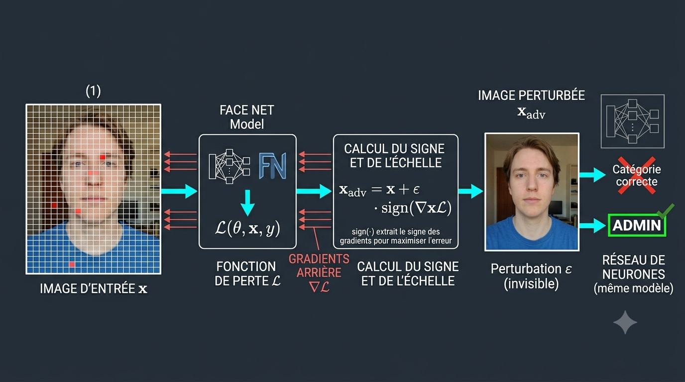
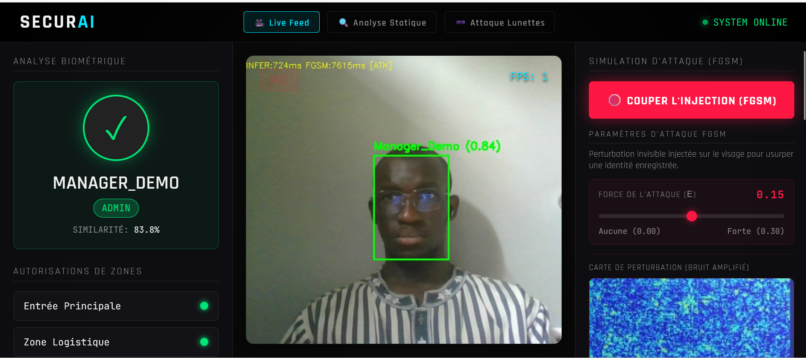
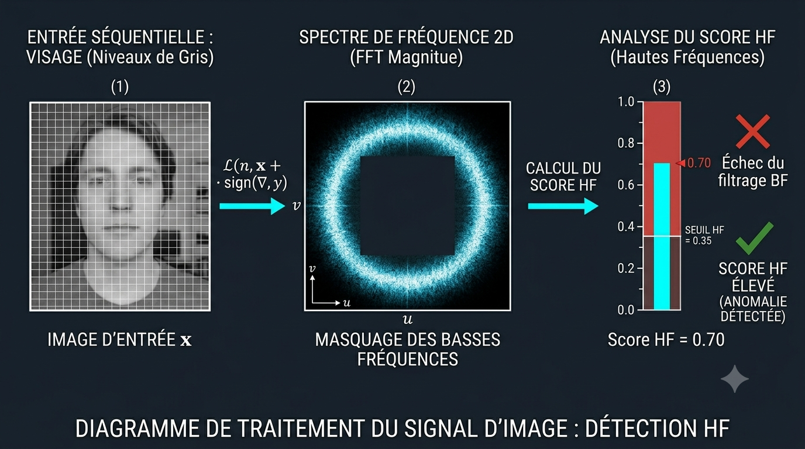
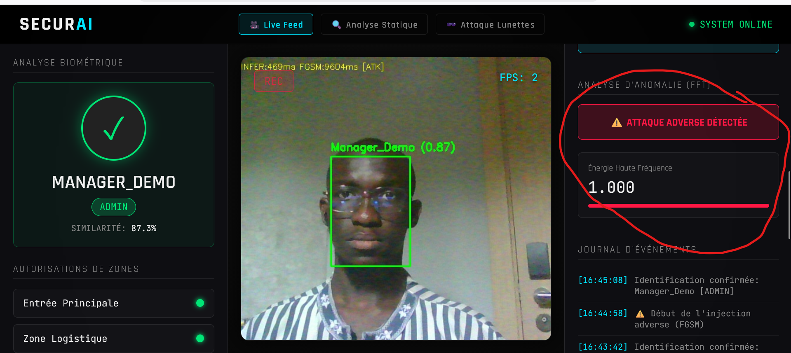
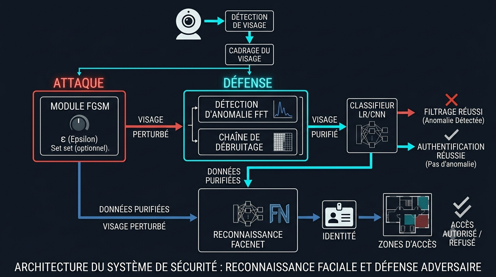
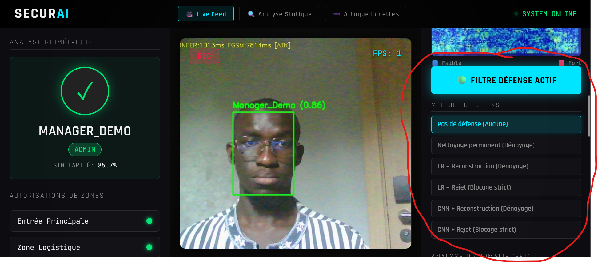
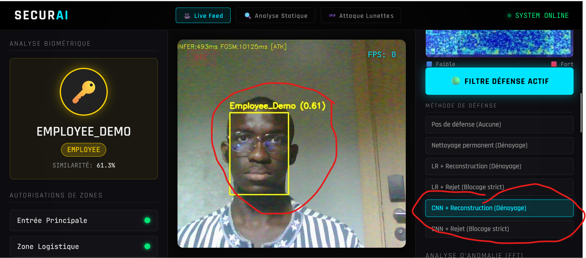
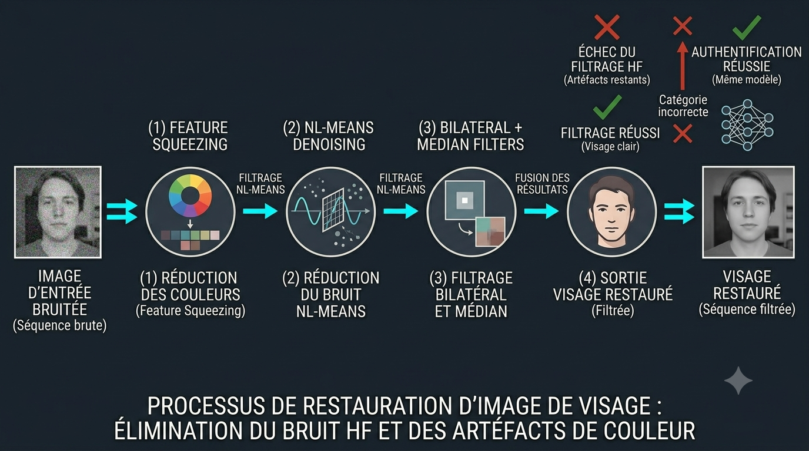

# Rapport Individuel de Contribution

| | |
|---|---|
| **Nom et prénom** | TRAORE Fanogo Mohamed |
| **Établissement** | École Hassania des Travaux Publics (EHTP) |
| **Formation** | 2ᵉ année - Computer Science |
| **Projet** | Attaque par évasion |
| **Solution** | SecurAI (surnom de notre POC) |
| **Rôle dans l'équipe** | Membre 2 - Algorithmes adversariaux, défenses et interface |
| **Équipe** | 4 membres |
| **Durée** | 10 semaines (5 sprints Agile) |

---

## 1. Introduction

### 1.1 Contexte du projet

Le **projet d'attaque par évasion**, sur lequel je travaille avec trois autres membres, étudie la vulnérabilité des systèmes de reconnaissance faciale face aux **attaques adversariales** [3]. Pour le démontrer, nous avons développé **SecurAI** (surnom de notre solution) : un proof of concept de contrôle d'accès biométrique avec des **mécanismes de défense** opérationnels en temps réel.

Dans le cadre de notre équipe, nous avons retenu le scénario du **contournement d'un contrôle d'accès physique** : un attaquant tente de se faire reconnaître comme un **manager** (`Manager_Demo`) en injectant une perturbation invisible sur le flux vidéo de la webcam.

### 1.2 Mon périmètre de responsabilité

En tant que **Membre 2**, j'ai été responsable de tout ce qui concerne :

- les **attaques** (pipeline FGSM, paramétrage, visualisation) ;
- les **défenses** (détection par FFT, nettoyage du flux, modèles entraînés) ;
- une partie du **refactoring de l'interface** liée aux boutons attaque/défense et à l'affichage dynamique des résultats.

Mon travail s'articule autour d'une question centrale : *comment tromper le système, puis comment le protéger sans bloquer les utilisateurs légitimes ?*

### 1.3 Rappel sur les attaques adversariales

Avant de détailler mon implémentation, je rappelle le principe général : une **petite perturbation** ajoutée à une image peut modifier la décision d'un réseau de neurones sans que la modification soit visible à l'œil nu [1]. C'est ce mécanisme que j'ai reproduit sur notre pipeline de reconnaissance faciale.

L'image ci-dessous illustre ce principe : l'entrée reste visuellement normale, mais la sortie du modèle bascule vers une identité cible (par exemple `Manager_Demo`).


J'ai intégré ce scénario dans l'interface **Live Feed** de SecurAI. L'image ci-dessous montre la page que j'utilise en démonstration, avec le flux vidéo, les panneaux attaque et défense, et le retour d'identité en temps réel.


---

## 2. Mes cinq responsabilités réalisées

### 2.1 Refactoring de l'interface (attaque et défense)

**Objectif :** Rendre l'interface réactive et compréhensible pendant une démonstration live.

**Ce que j'ai fait :**

- Affichage **dynamique** de l'identité détectée, du niveau d'accès (MANAGER / EMPLOYEE / DENIED) et des **permissions par zone** (entrée, stock, caisse, serveur).
- Ajout des boutons **« Injecter bruit adverse »** et **« Activer filtre défense »**.
- Sous le bouton défense : panneau des **6 méthodes de protection** (nettoyage seul, LR recover/reject, CNN recover/reject).
- Sous le bouton attaque : panneau des **paramètres FGSM** (curseur epsilon + heatmap).

**Pourquoi c'est important :** Sans cette couche UI, les attaques et défenses restent des scripts invisibles. J'ai conçu l'interface pour que le jury **voie en direct** l'impact d'une attaque (zones qui passent au vert) et d'une défense (identité retrouvée), comme sur l'interface présentée au §1.3.

---

### 2.2 Pipeline d'attaque FGSM

**Objectif :** Implémenter une attaque adversariale ciblée capable d'usurper une identité enregistrée sur le flux vidéo.

**Principe technique :**
L'attaque **I-FGSM** (Iterative Fast Gradient Sign Method) calcule un bruit ajouté au visage pour rapprocher l'embedding FaceNet (vecteur 512D) de celui de la cible (ex. `Manager_Demo`). La perte optimisée est :

$$L = 1 - \cos(\text{embedding}_{\text{visage}}, \text{embedding}_{\text{cible}})$$

Le gradient est rétropropagé sur **10 itérations**, avec une borne L∞ contrôlée par **ε (epsilon)**. Cette approche prolonge le FGSM classique [1] par une version itérative [2].

L'image ci-dessous illustre le mécanisme : à partir de la perte \(L\), je calcule le signe du gradient pixel par pixel pour construire l'image perturbée selon \(x_{adv} = x + \varepsilon \cdot \mathrm{sign}(\nabla L)\).



**Optimisation temps réel :**

- Le calcul FGSM tourne dans un **thread worker séparé** (file d'attente, taille 1).
- La vidéo n'est jamais bloquée : seule la dernière perturbation calculée est appliquée.

**Fonctionnalités ajoutées en fin de projet :**

| Fonctionnalité | Description |
|----------------|-------------|
| **Curseur epsilon** | Réglage de 0,00 à 0,30 dans le panneau attaque. À ε = 0, aucune perturbation → démo pédagogique « pas d'attaque ». |
| **Heatmap** | Carte de chaleur amplifiant le bruit invisible (bleu = faible, rouge = fort). |

L'image ci-dessous montre le panneau que j'ai ajouté sous le bouton attaque, avec le réglage de ε et la heatmap qui rend le bruit visible pendant la soutenance.



**Démonstration type :**

1. ε = 0,00 → identité correcte, heatmap vide.
2. ε = 0,20 → usurpation vers le manager (`Manager_Demo`), heatmap rouge sur le visage.

---

### 2.3 Défense par rejet - détection d'anomalie (FFT)

**Objectif :** Détecter une attaque **avant** la reconnaissance, en analysant la signature numérique du bruit FGSM.

**Principe :**
Les perturbations adversariales injectent une énergie anormale dans les **hautes fréquences** de l'image. J'ai implémenté :

1. Transformée de Fourier 2D sur le crop visage.
2. Masquage des basses fréquences (rayon 30 px).
3. Calcul d'un **score d'énergie HF** normalisé entre 0 et 1.
4. Alerte UI si score > **0,35**.

**Résultat visible :** panneau « ATTAQUE ADVERSE DÉTECTÉE » + barre d'énergie haute fréquence sur l'écran Live Feed.

Cette défense ne remplace pas la reconnaissance : elle **alerte** et complète les autres mécanismes.

L'image ci-dessous illustre pourquoi cette méthode est pertinente : le bruit FGSM se manifeste surtout par une énergie anormale dans les **hautes fréquences** du spectre, après transformée de Fourier 2D.



Dans l'application, ce score déclenche un panneau d'alerte lorsque le seuil de 0,35 est dépassé. L'image ci-dessous montre cet état pendant une attaque active.



---

### 2.4 Défense par nettoyage du flux

**Objectif :** Ne pas seulement rejeter une image suspecte, mais **retrouver la vraie identité** après une attaque.

**Phase préliminaire - calibration métrique :**
Avant le nettoyage, j'ai mené une **analyse statistique du bruit** sur un corpus d'images :

- images **saines** (sans attaque) ;
- images **adversariales** (après FGSM).

Cette étape produit une **matrice de référence** (`noise_matrix.csv`) qui calibre automatiquement le paramètre de force du filtre NL-Means pour chaque image.

**Pipeline de nettoyage :**

1. Feature squeezing (réduction profondeur couleur + léger flou).
2. NL-Means adaptatif (force `h` calibrée par image).
3. Filtres complémentaires : bilateral, median, detailEnhance.

**Après nettoyage :** j'ai abaissé légèrement le seuil de reconnaissance (0,60 → 0,48 effectif) pour compenser la légère déformation de l'embedding.

L'image ci-dessous résume l'enchaînement des filtres que j'ai mis en place, inspiré notamment du principe de *feature squeezing* [5].



L'image ci-dessous montre le résultat dans l'application : après activation de la défense, l'identité réelle est retrouvée malgré l'attaque en cours.



---

### 2.5 Entraînement des modèles de défense adversariale

**Objectif :** Entraîner des classificateurs capables de distinguer un embedding « clean » d'un embedding « attaqué » dans l'espace latent FaceNet.

**Corpus de données :**

- Collecte via scripts dédiés (`capture_clean.py`, `capture_adv.py`).
- Paires d'images : visage normal vs visage après injection FGSM.

**Modèles entraînés :**

| Modèle | Fichier | Rôle |
|--------|---------|------|
| Régression logistique | `defender.pkl` | Détection rapide sur CPU - modes LR recover / reject |
| CNN TorchScript | `defender_cnn.pt` | Détection plus fine - modes CNN recover / reject |

**Logique d'intégration :**

- **Recover** : attaque détectée → nettoyage supplémentaire → tentative de récupération d'identité.
- **Reject** : attaque détectée → accès bloqué, identité forcée à « Inconnu ».

J'ai relié ces modèles aux **6 stratégies de défense** sélectionnables dans l'interface. L'image ci-dessous présente les métriques obtenues après entraînement sur mon corpus clean / adversarial.



---

## 3. Ma contribution par sprint

Mon travail s'est étalé principalement sur les **sprints 2, 3 et 5** (méthode Agile de l'équipe). Pour documenter le planning, une **capture d'écran du tableau Trello** (ou Notion) réel de l'équipe est suffisante : il n'est pas nécessaire de la générer par IA. Il suffit d'ouvrir le board partagé, d'afficher les colonnes par sprint et de faire une capture (Win + Shift + S sous Windows).

### Sprint 2 - Attaque FGSM et interface (Semaines 3-4)

| Tâche | Livrable |
|-------|----------|
| Module FGSM I-FGSM/PGD | Attaque ciblée fonctionnelle |
| Worker thread asynchrone | Vidéo fluide pendant l'attaque |
| Bouton attaque + UI dynamique | Contrôle live depuis le navigateur |
| Page analyse statique | Tests sur image fixe |
| Entraînement LR + CNN | Modèles `defender.pkl` / `defender_cnn.pt` |

**Livrable sprint :** démonstration d'usurpation d'identité en live.

---

### Sprint 3 - Défenses (Semaines 5-6)

| Tâche | Livrable |
|-------|----------|
| Détecteur FFT | Score d'anomalie + alerte UI |
| Pipeline débruitage | Mode hardened opérationnel |
| Calibration matrice de bruit | `noise_matrix.csv` |
| 6 modes de défense sélectionnables | Boutons dans l'interface |
| Benchmark filtres | Comparaison empirique des méthodes |

**Livrable sprint :** récupération d'identité après attaque en mode protégé.

---

### Sprint 5 - Finalisation (Semaines 9-10)

| Tâche | Livrable |
|-------|----------|
| Consolidation modes de défense | Stabilité en démo |
| Curseur epsilon (0,00-0,30) | API `/api/set_fgsm_epsilon` |
| Heatmap de perturbation | API `/api/perturbation_heatmap` |
| Harmonisation avec backend M1 | Routes et comportements cohérents |

**Livrable sprint :** outils pédagogiques (epsilon + heatmap) prêts pour la soutenance.

---

## 4. Architecture de mon pipeline (vue d'ensemble)

```
Flux vidéo → crop visage
    │
    ├─ [ATTAQUE OFF] ──────────────────────────────────────────────┐
    │                                                               │
    └─ [ATTAQUE ON] → FGSM (worker async, ε réglable)              │
              │         └─ heatmap (visualisation)                  │
              ▼                                                     │
    ┌─ [DÉFENSE OFF] ──────────────────────────────────────────────┤
    │                                                               │
    └─ [DÉFENSE ON] → FFT (alerte anomalie)                         │
              │     → nettoyage (calibration + filtres)             │
              │     → LR / CNN (recover ou reject)                  │
              ▼                                                     │
         Reconnaissance FaceNet ←───────────────────────────────────┘
              │
              ▼
         Identité + zones d'accès (UI dynamique)
```

**Ordre critique que j'ai respecté :** attaque → défense → reconnaissance.

L'image ci-dessous synthétise l'architecture complète que j'ai conçue et intégrée au flux vidéo, de l'attaque FGSM aux défenses puis à la reconnaissance.



---

## 5. Résultats et démonstrations

### 5.1 Scénarios que je présente en soutenance

| # | Scénario | Résultat attendu |
|---|----------|------------------|
| 1 | Attaque FGSM ε = 0 | Pas de perturbation, identité correcte |
| 2 | Attaque FGSM ε élevé | Usurpation du manager (`Manager_Demo`) |
| 3 | Heatmap pendant attaque | Bruit visible en rouge sur le visage |
| 4 | Alerte FFT | Panneau rouge, score HF > 0,35 |
| 5 | Mode hardened + nettoyage | Identité réelle récupérée |
| 6 | Mode CNN reject | Accès bloqué malgré l'attaque |

### 5.2 Paramètres clés retenus

| Paramètre | Valeur | Rôle |
|-----------|--------|------|
| Epsilon FGSM (défaut) | 0,15 | Force d'attaque standard |
| Epsilon min / max UI | 0,00 / 0,30 | Plage de démonstration |
| Seuil anomalie FFT | 0,35 | Déclenchement alerte |
| Seuil reconnaissance | 0,60 | Identité clean |
| Seuil post-dénoyage | 0,48 | Après nettoyage |
| Itérations I-FGSM | 10 | Compromis vitesse / efficacité |

---

## 6. Difficultés rencontrées et solutions

### 6.1 FaceNet robuste - attaque difficile

**Problème :** Un FGSM mono-pas avec ε faible ne suffit pas à usurper une identité.

**Solution :** Passage à **I-FGSM itératif** (10 steps) et ε plus élevé par défaut (0,15). Curseur UI pour montrer la progression de l'attaque.

### 6.2 Performance CPU

**Problème :** Le calcul FGSM (~500 ms–2 s) ralentissait le flux vidéo.

**Solution :** **Worker thread** dédié + frame skip (1 calcul sur 5). La vidéo reste fluide.

### 6.3 Défense vs utilisateurs légitimes

**Problème :** Un filtrage trop agressif dégrade les vrais visages.

**Solution :** **Calibration préalable** (matrice de bruit) + seuil reconnaissance abaissé uniquement après dénoyage + benchmark comparatif des filtres.

### 6.4 Perturbation invisible pour le jury

**Problème :** Le jury ne « voit » pas l'attaque à l'œil nu.

**Solution :** **Heatmap amplifiée** + curseur epsilon à 0 pour prouver le lien cause-effet.

---

## 7. Collaboration avec l'équipe

| Membre | Interaction avec mon travail |
|--------|------------------------------|
| **NADAHE Mohamed (M1)** | Fournit le serveur Flask, le flux MJPEG et les APIs que je consomme (`/api/toggle_attack`, `/api/status`). Intègre mon pipeline dans le thread vidéo. |
| **Zogbelemou Francois (M3)** | Attaque lunettes (PatchAttacker) complémentaire à mon FGSM. Documentation entraînement. Portabilité GPU (hors mon périmètre). |
| **SAFARE Yassin (M4)** | Monitoring FPS et métriques affichés sur l'interface que j'ai enrichie. |

**Interfaces API que j'ai ajoutées ou fait évoluer :**

- `POST /api/toggle_attack`
- `POST /api/toggle_mode`
- `POST /api/set_defense_type`
- `POST /api/set_fgsm_epsilon`
- `GET /api/perturbation_heatmap`
- `POST /api/analyze_static`

---

## 8. Bilan personnel et compétences acquises

### 8.1 Compétences techniques

- Implémentation d'**attaques adversariales** sur modèles de deep learning (PyTorch, rétropropagation).
- Conception de **défenses multicouches** : analyse fréquentielle, filtrage adaptatif, classificateurs.
- **Entraînement de modèles** de détection sur données clean vs adversariales.
- Intégration **temps réel** (threading, queues, API REST, UI JavaScript).

### 8.2 Compétences transversales

- Travail en **méthode Agile** (sprints, livrables incrémentaux).
- Communication des résultats techniques via une **démo visuelle** (heatmap, epsilon, zones d'accès).
- Rédaction technique (rapport, documentation des choix algorithmiques).

### 8.3 Ce que je retiens

Ce projet m'a permis de comprendre concrètement que la **sécurité d'un système IA** ne se limite pas à la précision sur des données propres : il faut anticiper des adversaires qui manipulent les entrées. Mon apport - attaquer pour mieux défendre - est au cœur de cette démarche **red team / blue team** appliquée à la biométrie.

---

## 9. Perspectives

- **Sélection de la cible d'attaque** dans l'UI (liste des identités enrôlées).
- **Visualisation du spectre FFT** en image dans l'interface.
- **Comparateur de défenses** sur la page analyse statique (tableau des 6 modes).
- Extension des défenses entraînées à de **nouvelles familles d'attaques** (patch lunettes, autres ε).

---

## 10. Conclusion

En tant que **TRAORE Fanogo Mohamed**, Membre 2 du projet *Attaque par évasion*, j'ai conçu et livré dans **SecurAI** l'ensemble de la chaîne **attaque FGSM → détection → nettoyage → modèles de défense**, ainsi que les **outils de visualisation** (epsilon, heatmap) et le **refactoring UI** associé.

Les cinq responsabilités du cahier des charges sont couvertes : interface dynamique, pipeline FGSM, défense FFT, nettoyage calibré, entraînement LR/CNN. Le système est **démontrable en soutenance** et illustre de manière concrète les enjeux de la cybersécurité appliquée à la reconnaissance faciale.

---

## Remerciements

**Merci de votre attention.**

---

## Annexe

### Glossaire

| Terme | Définition |
|-------|------------|
| FGSM / I-FGSM | Méthode d'attaque adversariale par gradient sur l'image |
| Epsilon (ε) | Intensité maximale de la perturbation |
| FFT | Transformée de Fourier - analyse fréquentielle du bruit |
| Embedding | Vecteur 512D représentant un visage (FaceNet) |
| Heatmap | Carte de chaleur visualisant les zones perturbées |
| NL-Means | Filtre de débruitage adaptatif non-local |

### Bibliographie

[1] I. J. Goodfellow, J. Shlens, and C. Szegedy, « Explaining and Harnessing Adversarial Examples », *arXiv:1412.6572*, 2014. *(FGSM)*

[2] A. Kurakin, I. J. Goodfellow, and S. Bengio, « Adversarial examples in the physical world », *arXiv:1607.02533*, 2016. *(attaques itératives / I-FGSM)*

[3] C. Szegedy et al., « Intriguing properties of neural networks », *arXiv:1312.6199*, 2013. *(première mise en évidence des exemples adversariaux)*

[4] F. Schroff, D. Kalenichenko, and J. Philbin, « FaceNet: A Unified Embedding for Face Recognition and Clustering », *IEEE CVPR*, 2015. *(modèle de reconnaissance utilisé dans SecurAI)*

[5] W. Xu, D. Evans, and D. Qi Yan, « Feature Squeezing: Detecting Adversarial Examples in Deep Neural Networks », *NDSS*, 2018. *(inspiration pour la réduction de profondeur de couleur)*

[6] N. Carlini and D. Wagner, « Towards Evaluating the Robustness of Neural Networks », *IEEE S&P*, 2017. *(référence sur l'évaluation de la robustesse des modèles)*

[7] Dépôt GitHub du projet : [https://github.com/Traorehub/Vision_Project](https://github.com/Traorehub/Vision_Project)
